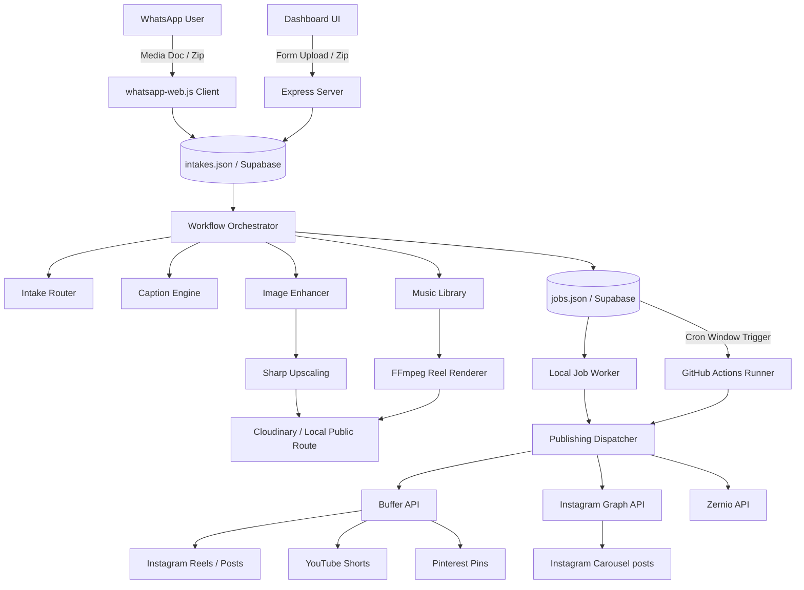

# Instagram Devotional Automation System

This document provides a comprehensive technical guide to the architecture, project structure, component workflows, and execution models of the **Instagram Automation** project.

---

## 1. System Overview

The system automates the ingest, rendering, scheduling, and publishing of devotional content (Reels, image posts, and multi-image carousels) to Instagram, YouTube, and Pinterest. 

It runs on a hybrid model:
1. **Local Server (Local Intake + QR Gateway)**: Automates a headless Chromium browser (`whatsapp-web.js`) to capture media documents sent via a configured WhatsApp chat. It processes image upscaling/enhancement and video rendering locally using FFmpeg.
2. **Cloud/Serverless Sync (Supabase + GitHub Actions)**: Optionally synchronizes the job queue and media hosting metadata to a Supabase database. A GitHub Actions runner checks the queue periodically during scheduled publishing windows to post carousels and images even when the local server is shut down.



---

## 2. Directory Structure

The repository is structured logically to divide core services, executable scripts, and local databases:

```text
insta-automation/
├── .github/
│   └── workflows/
│       └── run-due-jobs.yml          # GitHub Actions cron scheduler workflow
├── data/
│   ├── .wwebjs_auth/                 # Puppeteer session cache for WhatsApp Web
│   ├── media/                        # Local file asset store
│   │   ├── intake/                   # Extracted original images/videos
│   │   ├── enhanced/                 # sharp-upscaled 9:16 vertical images
│   │   └── reels/                    # ffmpeg-rendered video MP4 files
│   ├── music/                        # Local MP3 tracks library
│   ├── intakes.json                  # Local JSON store for intakes
│   ├── jobs.json                     # Local JSON store for queued/scheduled jobs
│   ├── music-library.json            # Manifest mapping music tracks to deities/moods
│   └── *.log / *.log.txt             # Runtime logs and event records
├── public/
│   ├── index.html / v2.html          # Web interfaces for the operator dashboard
│   └── dashboard assets...           # Static dashboard scripts and style sheets
├── scripts/
│   ├── run-due-jobs.js               # CLI script to execute due jobs in GHA/worker
│   ├── sync-local-state-to-supabase.js # Script to migrate local queues to Supabase
│   ├── verify-cloud-carousel-readiness.js # Validates setup for cloud workers
│   └── secondary integration scripts (Zernio, Pinterest, Blender POC tests)
├── src/
│   ├── server.js                     # Core Express server entry point
│   ├── config.js                     # Config loader parsing .env and environment validation
│   └── services/                     # Specialized functional modules
│       ├── whatsapp.js               # WhatsApp client wrapper and ingestion gateway
│       ├── workflow.js               # Central execution pipeline orchestrator
│       ├── intake-router.js          # Ingest classifier and schedule override parser
│       ├── intake-store.js           # Read/write interfaces for intakes
│       ├── jobs.js                   # Queue worker and scheduler engine
│       ├── job-processors.js         # Map of job kinds to execution hooks
│       ├── caption-engine.js         # Deterministic template caption engine
│       ├── cloudflare-caption.js     # LLM-based captioning using Cloudflare Workers AI
│       ├── image-enhancer.js         # sharp-based image upscaling & vertical backdrop compositing
│       ├── reel-renderer.js          # ffmpeg-based image-to-reel MP4 renderer
│       ├── music-library.js          # Track selector matching deities & moods
│       ├── media-hosting.js          # Media dispatcher (Cloudinary vs Local public folder)
│       ├── buffer.js                 # Integrates with Buffer REST/GraphQL APIs
│       ├── instagram-graph.js        # Official Graph API for carousel uploads
│       └── administrative/utility services (auth, short links, logging, database)
├── standalone-carousel-pipeline/    # Python subproject for custom instagrapi/carousel flow
├── package.json                      # Node.js project manifest & dependencies
└── README.md                         # Setup manual and system documentation
```

---

## 3. Core Component Workflows

### A. Asset Ingestion (WhatsApp Gateway)
* Component: [src/services/whatsapp.js](file:///e:/tests/insta%20automation/src/services/whatsapp.js)
1. **Startup**: Starts a Puppeteer browser instance automating WhatsApp Web. On the first run, the dashboard renders the generated QR code.
2. **Monitoring**: Listens for messages on `message_create` and `message` events in the chat configured via `WHATSAPP_ALLOWED_CHAT_NAME` or `WHATSAPP_ALLOWED_CHAT_ID`.
3. **Intake Processing**:
   - **Static Image / MP4 Video**: Downloads media documents, validates formats, writes them to `data/media/intake/`, creates a record in `data/intakes.json`, and enqueues a `process-whatsapp-intake` job.
   - **Official Carousel Packages (.zip)**: Extracting a `.zip` containing a series of sequential images and a text caption (`caption.txt` or any `.txt` file). Saves them in a `zip_carousel` format, directly routing it to the Instagram Graph API pipeline.
   - **Continuous Carousel Window**: If the user sends a message containing `carousel` or `album`, it opens a **5-minute window** (`WHATSAPP_CAROUSEL_WINDOW_MS`). All subsequent images sent during this window are appended to a draft. When the timer expires, the draft is finalized and scheduled as a single carousel post.
   - **Text Schedule Commands**: The text body of the WhatsApp message is parsed for schedule commands:
     - `publish now`/`immediate`: Fires publishing immediately.
     - `auto`/`overnight`: Schedules using the auto-schedule slot engine.
     - Custom time overrides: (e.g. `tomorrow at 4pm`, `monday 2:30am`) are parsed and scheduled directly for that date.

### B. Ingest Classification & Routing
* Component: [src/services/intake-router.js](file:///e:/tests/insta%20automation/src/services/intake-router.js)
The system analyzes the ingested files and caption texts using keywords to determine the delivery layout:
* **Video/MP4 Ingest**: Classified as a **Reel**. Preserves original source audio and posts to Instagram Reels, YouTube Shorts, and Pinterest Video.
* **Image Ingest + Reel Cue**: (If caption contains words like `reel`, `shorts`, `video`). Upscales the image, selects a matching Hindi track, and renders a 11-second vertical video. Fans out to Instagram Reels, YouTube Shorts, and Pinterest Image.
* **Image Ingest + No Reel Cue**: Treated as a static post. Scheduled as an Instagram Image post (via Buffer Notification publishing so music can be added in-app) and a Pinterest Image pin. YouTube is skipped.
* **Zip/Multi-Image Carousel**: Scheduled as an Instagram Carousel (via official Graph API) and immediate Pinterest Image pins for each slide.

### C. Visual Enhancement & Up-sampling
* Component: [src/services/image-enhancer.js](file:///e:/tests/insta%20automation/src/services/image-enhancer.js)
Standard landscape/square pictures look poor on vertical mobile feeds. The upsampler prepares images for high-definition 9:16 canvases (typically `1440x2560` pixels) using `sharp`:
1. **Backdrop Generation**: The source image is resized to fully cover the vertical canvas size, blurred heavily (`backdropBlur=28`), and modulated for lower brightness/saturation to prevent background competition.
2. **Subject Enhancement**: The original image is resized using a Lanczos kernel to fit cleanly inside the vertical canvas boundaries, sharpened using customized sigma filters, and slightly brightened.
3. **Composition**: The enhanced subject is composited over the blurred backdrop, rendering a premium vertical JPEG layout.

### D. Audio Selection & FFmpeg Video Rendering
* Components: [src/services/music-library.js](file:///e:/tests/insta%20automation/src/services/music-library.js) & [src/services/reel-renderer.js](file:///e:/tests/insta%20automation/src/services/reel-renderer.js)
When an image is scheduled as a Reel, a video must be dynamically generated:
1. **Audio Match**: The system crawls the text body of the intake and matches it against deity tags (e.g., Rama, Shiva, Krishna, Hanuman) and themes (e.g., surrender, peace) defined in `data/music-library.json`. It resolves a corresponding MP3 track stored in `data/music/`.
2. **Reel Assembly**: Invokes static `ffmpeg` to loop the enhanced vertical image over the matched MP3 track.
3. **Sound Sculpting**: Cuts the audio to exactly 11 seconds (configurable) starting at the track's configured hook timestamp, applies an audio fade-out filter (`afade`) during the final 1.5 seconds, and encodes using H.264 video and AAC audio compression.

### E. Caption Generation (Local Templates & LLM)
* Component: [src/services/caption-engine.js](file:///e:/tests/insta%20automation/src/services/caption-engine.js)
Captions are shaped to fit a cohesive devotional aesthetic:
- **Context Classification**: Evaluates the text body and filenames for deity and theme tags.
- **AI Synthesis (Optional)**: If Cloudflare Workers AI is configured, the system uses an LLM (such as `glm-4.7-flash` or `llama-4-scout`) alongside image analysis to generate a short, emotionally touching caption in English or Hindi.
- **Rule-based Templates (Fallback)**: If Cloudflare is offline, it selects deterministically from a local template bank matching the deity.
- **SEO & Hashtags**: Generates relevant search terms and caps hashtags at 5 (e.g., `#sanatandharma #radharani #krishnaji #toonart #viralreels`) to maintain clean post styling.
- **Forced Quotes**: Any text enclosed in quotes (e.g., `“Sakal hans me rame viraje...”`) in the user's WhatsApp message is parsed and forced verbatim at the beginning of the post caption.

---

## 4. Scheduling & Execution Models

The scheduler divides jobs based on queue density, target platforms, and festival indicators:

```text
Reels Posting Windows (2:00 PM - 3:00 PM IST family)
└── Primary Slot   --> 2:00 PM IST
└── Secondary Slot --> 2:30 PM IST (Active if backlog >= 3 posts)
└── Overflow Slot  --> 3:00 PM IST (Active if backlog >= 8 posts)

Carousels Posting Window (11:00 PM IST)
└── Carousel Slot  --> 11:00 PM IST (Strict limit of 1 per day)
```

1. **Devotional Calendar Anchors**: 
   - [src/services/devotional-calendar.js](file:///e:/tests/insta%20automation/src/services/devotional-calendar.js) contains a mapped index of major 2026 Hindu festivals (Shivratri, Hanuman Jayanti, Diwali, Krishna Janmashtami, etc.).
   - If a post falls on a festival date, it receives a **festival priority boost** and the caption generator incorporates relevant deity symbols. Otherwise, it falls back to weekday devotional themes (e.g., Monday = Shiva, Tuesday = Hanuman).
2. **Execution Modes**:
   - **Local Worker** (`local_worker`): The server runs a background timer polling `data/jobs.json` every 750ms. If a job is due, the server processes it.
   - **GitHub Actions Window** (`github_actions_window`): Designed to handle PC offline times. 
     - The database provider shifts to `supabase`. Local WhatsApp intake processes write queue states directly to Supabase tables.
     - A GitHub Actions cron workflow runs every 5 minutes during the designated posting windows (**11:00 PM - 12:00 AM IST** and **2:00 AM - 3:00 AM IST**).
     - The workflow executes `scripts/run-due-jobs.js`, pulling jobs from Supabase, executing them in the cloud, and utilizing Cloudinary URLs for asset fetching.
     - Post-publish, the worker triggers a WhatsApp notification back to the user chat.

---

## 5. Environment & Third-Party Integration

The system leverages several cloud platforms to distribute and publish content:

| Provider | Purpose | Configuration Keys |
| :--- | :--- | :--- |
| **Cloudinary** | CDN Hosting for rendered MP4s and upscaled images | `CLOUDINARY_CLOUD_NAME`, `CLOUDINARY_UPLOAD_PRESET` |
| **Buffer API** | Standard image scheduling and Reels cross-posting | `BUFFER_API_KEY`, `BUFFER_DEFAULT_CHANNEL_ID` |
| **Instagram Graph** | Direct, automated carousel publishing (bypassing Buffer) | `GRAPH_IG_USER_ID`, `GRAPH_ACCESS_TOKEN` |
| **Supabase** | Cloud queue database for GitHub Actions execution | `SUPABASE_URL`, `SUPABASE_SERVICE_ROLE_KEY` |
| **Cloudflare AI** | Cognitive analysis of image content and caption writing | `CLOUDFLARE_ACCOUNT_ID`, `CLOUDFLARE_API_TOKEN` |
| **Zernio** | Secondary API integration for Pinterest publishing | `ZERNIO_API_KEY`, `ZERNIO_ACCOUNT_ID` |

---

## 6. Verification and Testing

A comprehensive test harness is located at [tests/run-tests.js](file:///e:/tests/insta%20automation/tests/run-tests.js). It sets up isolated mock folders in the operating system's temp directory and runs unit tests for:
* Saving and routing WhatsApp intakes (static, carousel, and zip files).
* Parsing inline WhatsApp text scheduling overrides.
* Deterministic caption and distribution planning.
* Audio selection matching specific deities.
* FFMPEG video rendering and image upscaling (Sharp).
* Local state switching and mock Buffer schema validations.

You can verify the codebase at any time by running:
```bash
npm test
```
